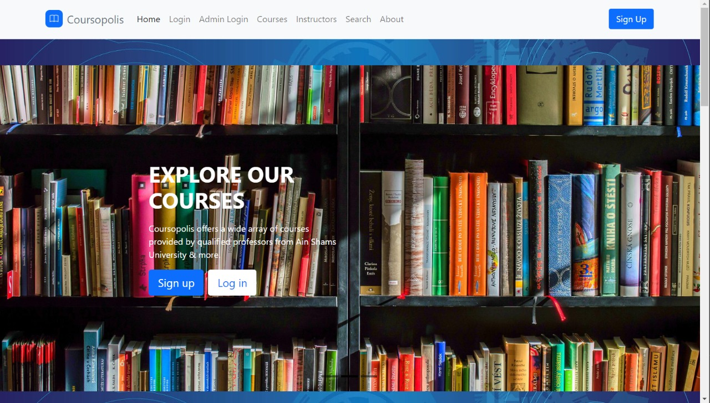

# Online-Courses-Website - Coursopolis Online Center

# How to run
 - Install XAMPP (Apache and MySQL) to run your local database
 
 - Database username="root" password=""
 
 - Run the online_courses.sql SQL script on your phpMyAdmin to create the database
 
 - Type in any browser this URL http://localhost/'YOUR_PATH'/index.php to start the website
 
 # This is the home webpage when you start the website

